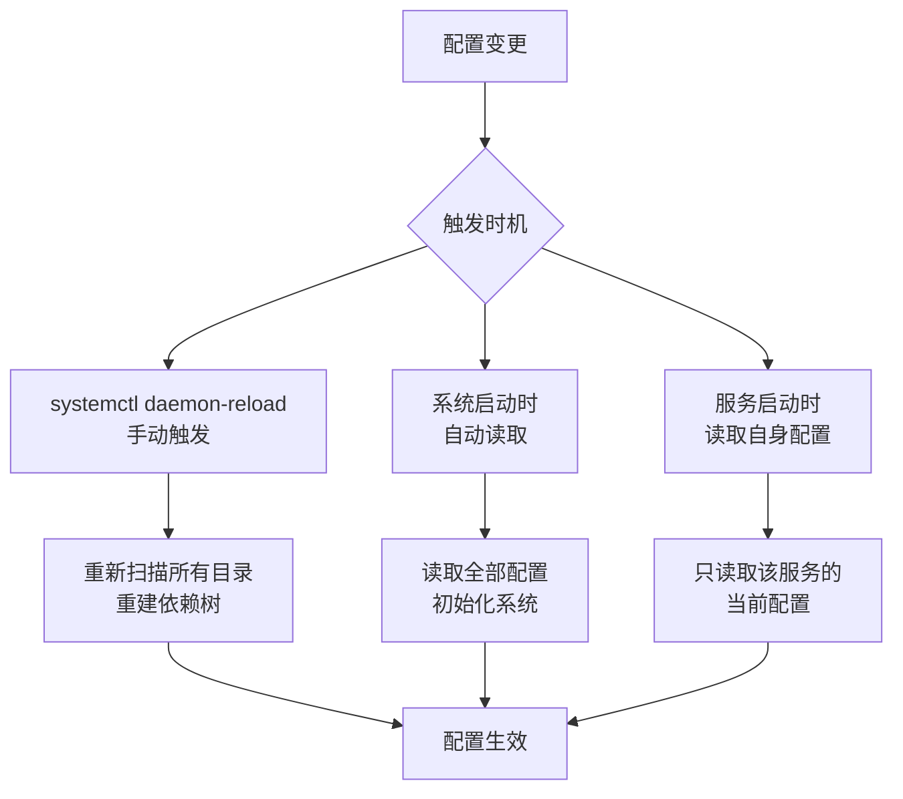

## systemd 的生效逻辑深度解析

这是一个非常好的问题！理解 systemd 的生效逻辑，就能真正掌握 Linux 服务管理的本质。让我从核心原理到实践全面拆解。

---

## 一、systemd 的核心架构

### 1.1 systemd 是什么？

systemd 是 Linux 系统的 **1号进程**（PID 1），是所有进程的“祖先进程”，负责：
- 管理系统服务（启动、停止、重启）
- 处理服务依赖关系
- 监控服务状态
- 管理系统资源

```
┌─────────────────────────────────────────────────────────────────┐
│                        Linux 进程树                              │
├─────────────────────────────────────────────────────────────────┤
│                                                                  │
│                         PID 1 (systemd)                          │
│                      系统和服务管理器                             │
│                              │                                   │
│         ┌────────────────────┼────────────────────┐              │
│         ▼                    ▼                    ▼              │
│    ┌─────────┐         ┌─────────┐         ┌─────────┐         │
│    │ docker  │         │ nginx   │         │ mysql   │         │
│    │ (PID 123)│         │ (PID 456)│         │ (PID 789)│         │
│    └─────────┘         └─────────┘         └─────────┘         │
│         │                    │                    │              │
│         ▼                    ▼                    ▼              │
│    子进程们              子进程们              子进程们           │
│                                                                  │
└─────────────────────────────────────────────────────────────────┘
```

### 1.2 systemd 的配置层次

systemd 的配置分为三个层次，优先级从高到低：

```
┌─────────────────────────────────────────────────────────────────┐
│                    配置层次（优先级：高 → 低）                     │
├─────────────────────────────────────────────────────────────────┤
│                                                                  │
│  Level 1: 运行时配置（最高优先级）                               │
│  └── /run/systemd/system/                                       │
│      临时配置，重启后消失                                         │
│                                                                  │
│  Level 2: 系统管理员配置                                         │
│  └── /etc/systemd/system/                                       │
│      用户自定义配置，覆盖系统默认                                 │
│                                                                  │
│  Level 3: 系统默认配置（最低优先级）                             │
│  └── /usr/lib/systemd/system/                                   │
│      软件包安装时生成的默认配置                                   │
│                                                                  │
└─────────────────────────────────────────────────────────────────┘
```

**生效规则**：
- systemd 会优先使用 `/etc/systemd/system/` 中的配置
- 如果不存在，则使用 `/usr/lib/systemd/system/` 中的默认配置
- `/run/` 是临时配置，重启后失效

---

## 二、配置的生效时机

### 2.1 systemd 的配置读取机制

systemd **不是实时监控配置文件变化**的。它在以下时机读取配置：



### 2.2 配置生效的完整流程

```
┌─────────────────────────────────────────────────────────────────┐
│            systemd 配置生效的完整生命周期                         │
├─────────────────────────────────────────────────────────────────┤
│                                                                  │
│  1. 配置文件存在于磁盘                                            │
│     ├── /etc/systemd/system/docker.service                      │
│     └── /usr/lib/systemd/system/docker.service                  │
│                                                                  │
│  2. systemd 不知道配置存在                                        │
│     └── 内存中没有这些信息                                        │
│                                                                  │
│  3. 执行 systemctl daemon-reload                                 │
│     ├── systemd 扫描所有配置目录                                 │
│     ├── 解析所有 .service、.socket、.timer 文件                  │
│     ├── 验证语法正确性                                           │
│     ├── 解析依赖关系（After、Before、Requires）                  │
│     ├── 加载环境变量文件                                         │
│     └── 将配置加载到内存                                         │
│                                                                  │
│  4. 执行 systemctl restart docker                                │
│     ├── systemd 读取内存中的 docker 配置                         │
│     ├── 停止旧进程（使用旧配置）                                 │
│     └── 启动新进程（使用新配置）                                 │
│                                                                  │
│  5. 配置最终生效                                                  │
│                                                                  │
└─────────────────────────────────────────────────────────────────┘
```

---

## 三、核心概念：单元文件（Unit File）

### 3.1 什么是单元文件？

单元文件是 systemd 的配置文件，定义了如何管理一个服务。

**Docker 的单元文件示例**（`/usr/lib/systemd/system/docker.service`）：

```ini
[Unit]
Description=Docker Application Container Engine
Documentation=https://docs.docker.com
After=network-online.target firewalld.service
Wants=network-online.target

[Service]
Type=notify
# 核心配置：启动命令
ExecStart=/usr/bin/dockerd -H fd:// --containerd=/run/containerd/containerd.sock
ExecReload=/bin/kill -s HUP $MAINPID
TimeoutSec=0
RestartSec=2
Restart=always

# 环境变量文件
EnvironmentFile=-/etc/default/docker

# 进程管理
Delegate=yes
KillMode=process
OOMScoreAdjust=-500

[Install]
WantedBy=multi-user.target
```

### 3.2 单元文件的三大区块

| 区块 | 作用 | 关键配置 |
|------|------|----------|
| **[Unit]** | 服务描述和依赖 | `Description`、`After`、`Requires` |
| **[Service]** | 服务运行配置 | `ExecStart`、`Restart`、`EnvironmentFile` |
| **[Install]** | 安装配置 | `WantedBy`（开机启动目标） |

---

## 四、生效逻辑的四个关键概念

### 4.1 概念1：配置加载 vs 服务重启

```
┌─────────────────────────────────────────────────────────────────┐
│                   配置加载 vs 服务重启                           │
├─────────────────────────────────────────────────────────────────┤
│                                                                  │
│  daemon-reload              restart                             │
│       ↓                        ↓                                │
│  ┌─────────────┐          ┌─────────────┐                      │
│  │ 磁盘 → 内存  │          │ 进程重启     │                      │
│  └─────────────┘          └─────────────┘                      │
│       ↓                        ↓                                │
│  systemd 知道新配置          服务进程使用新配置                   │
│                                                                  │
│  两者缺一不可！                                                  │
│                                                                  │
│  只有 daemon-reload：systemd 知道新配置，但服务还在用旧配置       │
│  只有 restart：服务重启，但 systemd 还在用内存中的旧配置          │
│  两者都有：✅ 配置完全生效                                       │
│                                                                  │
└─────────────────────────────────────────────────────────────────┘
```

### 4.2 概念2：依赖解析

systemd 在 `daemon-reload` 时会解析所有依赖关系：

```ini
[Unit]
# 必须在 network.target 之后启动
After=network.target
# 需要 docker.socket 存在
Requires=docker.socket
# 希望 network.target 也存在（软依赖）
Wants=network.target
```

**依赖树示例**：

```
multi-user.target
    │
    ├── docker.service
    │       ├── After: network.target ✓
    │       ├── Requires: docker.socket ✓
    │       └── Wants: network.target ✓
    │
    └── nginx.service
            └── After: docker.service ✓
```

### 4.3 概念3：环境变量加载

```ini
[Service]
# 加载环境变量文件
EnvironmentFile=-/etc/default/docker
# 直接定义环境变量
Environment="HTTP_PROXY=http://proxy:8080"
```

**加载时机**：
- `daemon-reload` 时：读取文件路径，但不展开内容
- `restart` 时：读取文件内容，注入到进程环境

### 4.4 概念4：目标的启用与禁用

```bash
# 启用开机自启
sudo systemctl enable docker
# 实际做了什么？
# 1. 在 /etc/systemd/system/multi-user.target.wants/ 创建软链接
# 2. 指向 /usr/lib/systemd/system/docker.service
# 3. 系统启动时会扫描 .wants/ 目录，启动所有链接的服务

# 禁用开机自启
sudo systemctl disable docker
# 实际做了什么？
# 1. 删除 /etc/systemd/system/multi-user.target.wants/docker.service
```

---

## 五、实战示例：修改 Docker 配置

### 5.1 完整流程

```bash
# 1. 修改配置文件
sudo nano /etc/docker/daemon.json

# 2. 验证配置
sudo cat /etc/docker/daemon.json | python3 -m json.tool

# 3. 重新加载 systemd 配置
sudo systemctl daemon-reload
# 此时：systemd 知道配置文件变了，但 Docker 进程还在运行旧配置

# 4. 重启 Docker 服务
sudo systemctl restart docker
# 此时：Docker 进程重启，读取新配置

# 5. 验证生效
docker info | grep "Registry Mirrors"
```

### 5.2 如果只执行一半会怎样？

```bash
# 错误示例1：只 daemon-reload，不 restart
sudo systemctl daemon-reload
# 结果：systemd 知道新配置，但 Docker 还在用旧配置运行
docker info | grep "Registry Mirrors"  # 空，没生效

# 错误示例2：只 restart，不 daemon-reload
sudo systemctl restart docker
# 结果：Docker 重启了，但 systemd 内存中还是旧配置
# 如果修改的是 .service 文件，新配置不会生效
```

---

## 六、深入：systemd 的缓存机制

### 6.1 内存缓存

systemd 将所有配置缓存在内存中：

```bash
# 查看 systemd 内存中的配置
sudo systemctl cat docker

# 这个输出是从内存读取的，不是直接从磁盘读的
```

### 6.2 磁盘文件 vs 内存配置

```
磁盘文件                    内存配置
/etc/systemd/system/        systemd 进程内存
    ↓                           ↓
docker.service  ←─daemon-reload─┘
                    (重新加载)
```

**关键点**：
- 修改磁盘文件后，内存配置不会自动更新
- 必须执行 `daemon-reload` 才能同步
- 这就是为什么需要手动执行这个命令

---

## 七、生效逻辑总结图

```
┌─────────────────────────────────────────────────────────────────┐
│                    systemd 生效逻辑全景图                        │
├─────────────────────────────────────────────────────────────────┤
│                                                                  │
│  ┌─────────────────────────────────────────────────────────┐    │
│  │                    磁盘文件                              │    │
│  │  /etc/systemd/system/docker.service                     │    │
│  │  /etc/docker/daemon.json                                │    │
│  └─────────────────────────────────────────────────────────┘    │
│                           │                                      │
│                           ▼                                      │
│              systemctl daemon-reload                             │
│                           │                                      │
│                           ▼                                      │
│  ┌─────────────────────────────────────────────────────────┐    │
│  │                  systemd 内存配置                        │    │
│  │  • 单元文件内容                                          │    │
│  │  • 依赖关系树                                            │    │
│  │  • 环境变量路径                                          │    │
│  └─────────────────────────────────────────────────────────┘    │
│                           │                                      │
│                           ▼                                      │
│                systemctl restart docker                         │
│                           │                                      │
│         ┌─────────────────┴─────────────────┐                   │
│         ▼                                   ▼                   │
│  ┌─────────────┐                    ┌─────────────┐            │
│  │ 停止旧进程   │                    │ 读取环境变量 │            │
│  │ (旧配置)    │                    │ (从磁盘)    │            │
│  └─────────────┘                    └─────────────┘            │
│         │                                   │                   │
│         └─────────────────┬─────────────────┘                   │
│                           ▼                                      │
│                  ┌─────────────────┐                            │
│                  │ 启动新进程       │                            │
│                  │ (使用新配置)    │                            │
│                  └─────────────────┘                            │
│                           │                                      │
│                           ▼                                      │
│                    ✅ 配置生效                                   │
│                                                                  │
└─────────────────────────────────────────────────────────────────┘
```

---

## 八、常见场景与正确操作

| 场景 | 正确操作 | 说明 |
|------|----------|------|
| **修改 daemon.json** | `daemon-reload` → `restart` | 需要先让 systemd 知道，再重启服务 |
| **修改 .service 文件** | `daemon-reload` → `restart` | 同上 |
| **创建新服务** | `daemon-reload` → `start` → `enable` | 先加载，再启动，最后设置开机自启 |
| **删除服务** | `stop` → `disable` → `daemon-reload` | 先停止，再禁用，最后清理缓存 |
| **只改环境变量** | `daemon-reload` → `restart` | 环境变量在启动时读取 |

---

## 九、快速排查命令

```bash
# 查看 systemd 内存中的配置
sudo systemctl cat docker

# 查看服务状态
sudo systemctl status docker

# 查看服务启动日志
sudo journalctl -u docker -n 50

# 查看 systemd 依赖树
sudo systemctl list-dependencies docker

# 查看所有已加载的服务单元
sudo systemctl list-units --type=service
```

---

## 十、总结

**systemd 生效逻辑的核心三要素**：

| 要素 | 说明 |
|------|------|
| **配置来源** | 磁盘文件（/etc、/usr/lib、/run） |
| **加载时机** | daemon-reload（手动）、系统启动（自动） |
| **应用时机** | 服务启动/重启时 |

**黄金法则**：
> **修改配置 → daemon-reload → restart**

**记忆口诀**：
> 先让 systemd 知道（daemon-reload），再让服务做到（restart）。

这个机制确保了 systemd 既能灵活管理配置，又能保持运行时的稳定性。理解了这个逻辑，你就能驾驭任何 Linux 服务的管理了！