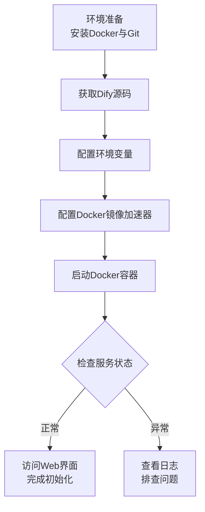
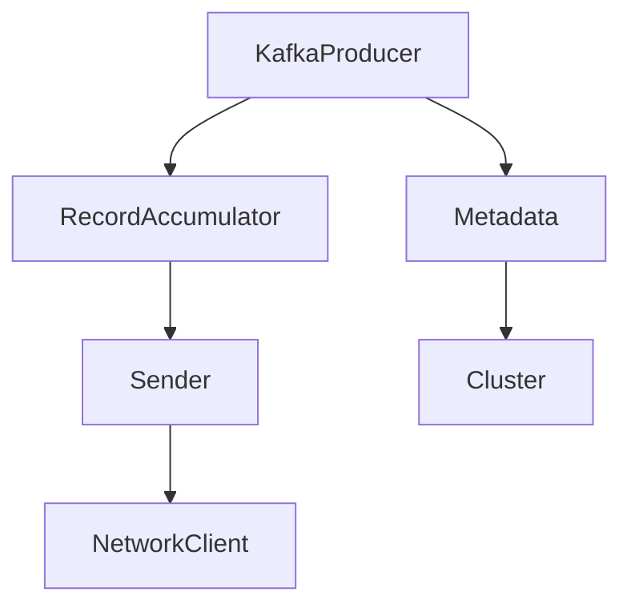

基于你的需求，我来设计一个完整的Dify Agent方案，专门用于个人知识库中的开源代码分析，并支持架构图生成。

---

## 一、整体架构设计

```
┌─────────────────────────────────────────────────────────────────┐
│                     Dify Agent 代码分析系统                      │
├─────────────────────────────────────────────────────────────────┤
│                                                                  │
│  ┌────────────────────────────────────────────────────────┐     │
│  │              知识库层（代码存储与检索）                   │     │
│  │  ┌──────────┐ ┌──────────┐ ┌──────────┐              │     │
│  │  │ Kafka源码│ │ Flink源码│ │ 自研项目 │  ...         │     │
│  │  │ 知识库   │ │ 知识库   │ │ 知识库   │              │     │
│  │  └──────────┘ └──────────┘ └──────────┘              │     │
│  │         ↓              ↓              ↓                │     │
│  │  ┌──────────────────────────────────────────────┐    │     │
│  │  │      代码感知分块（按函数/类切分）             │    │     │
│  │  └──────────────────────────────────────────────┘    │     │
│  └────────────────────────────────────────────────────────┘     │
│                              ↓                                   │
│  ┌────────────────────────────────────────────────────────┐     │
│  │                 Agent 编排层（工作流）                   │     │
│  │                                                        │     │
│  │  ┌──────────┐ ┌──────────┐ ┌──────────┐ ┌──────────┐ │     │
│  │  │ 意图识别 │→│ 知识检索 │→│ 代码分析 │→│ 图表生成 │ │     │
│  │  │  节点   │ │   节点   │ │   节点   │ │   节点   │ │     │
│  │  └──────────┘ └──────────┘ └──────────┘ └──────────┘ │     │
│  │       │            │            │            │        │     │
│  │       └────────────┴────────────┴────────────┘        │     │
│  │                        ↓                               │     │
│  │              ┌──────────────────┐                      │     │
│  │              │   输出格式化     │                      │     │
│  │              │ （Mermaid/SVG）  │                      │     │
│  │              └──────────────────┘                      │     │
│  └────────────────────────────────────────────────────────┘     │
│                                                                  │
└─────────────────────────────────────────────────────────────────┘
```

---

## 二、分步实施指南

### 2.1 环境准备

好的，我们来一步步完成 Dify 的本地部署。

整个过程可以拆解为下面几个清晰的步骤，跟着操作就好：



---

### 📦 第一步：环境准备

Dify 官方推荐使用 Docker Compose 进行部署，这是最简便的方式。你需要先安装好以下工具：

1.  **Docker**：用于运行容器化应用。
2.  **Docker Compose**：用于编排和管理多个Docker容器。
3.  **Git**：用于从GitHub克隆Dify的源代码。

**硬件最低要求**：
*   **CPU**：2核
*   **内存**：4GB（推荐8GB）
*   **存储**：20GB可用空间

**Ubuntu/Debian 系统一键安装命令**：
```bash
# 更新软件包列表
sudo apt update

# 安装Docker、Docker Compose和Git
sudo apt install -y docker.io docker-compose git

# 启动Docker服务并设置开机自启
sudo systemctl start docker
sudo systemctl enable docker

# 将当前用户添加到docker组，避免每次使用sudo（需要重新登录生效）
sudo usermod -aG docker $USER
```
> **💡 注意**：如果你是Windows或macOS用户，推荐安装 **Docker Desktop**，它已经自带了 Docker Compose。

---

### ⬇️ 第二步：获取 Dify 源码并进入部署目录

使用 `git` 命令将 Dify 的完整代码仓库克隆到本地：

```bash
# 克隆Dify仓库到当前目录
git clone https://github.com/langgenius/dify.git

# 进入Docker部署配置所在的目录
cd dify/docker
```

---

### ⚙️ 第三步：配置环境变量

在 `dify/docker` 目录下，你会看到一个名为 `.env.example` 的示例配置文件，我们需要将它复制一份并重命名为 `.env`：

```bash
cp .env.example .env
```
这个 `.env` 文件包含了Dify所有服务的配置。**在大多数情况下，使用默认配置就足以成功启动**，你可以先不修改它。

---

### 🚀 第四步：启动 Dify 服务

这是最核心的一步，执行以下命令，Docker Compose 就会根据配置文件自动拉取所需的镜像并启动所有服务：

```bash
docker compose up -d
```

*   **`docker compose`**：Docker Compose的命令。
*   **`up`**：创建并启动所有容器。
*   **`-d`**：后台模式运行，终端不会卡住。

**首次启动**需要下载多个镜像文件，总大小约数GB，具体耗时取决于你的网络状况。如果下载速度慢，可以参考第五步配置国内镜像加速器。

启动后，可以通过下面的命令查看所有容器的运行状态：

```bash
docker compose ps
```

当所有服务的状态都显示为 **`Up`** 或 **`healthy`** 时，说明启动成功了。

---

### 🌐 第五步（可选）：配置国内镜像加速器

如果在第四步拉取镜像时速度很慢或反复失败，可以配置国内的Docker镜像加速器。

编辑Docker的配置文件 `/etc/docker/daemon.json`：

```bash
sudo nano /etc/docker/daemon.json
```

添加或修改为以下内容（可选用多个镜像源）：

```json
{
  "registry-mirrors": [
    "https://docker.mirrors.ustc.edu.cn",
    "https://hub-mirror.c.163.com",
    "https://docker.xuanyuan.me"
  ]
}
```

保存后，重启Docker服务使配置生效：

```bash
sudo systemctl daemon-reload
sudo systemctl restart docker
```

重启后，再次执行第四步的 `docker compose up -d` 即可。

---

### 🎉 第六步：访问 Dify 并完成初始化

打开浏览器，访问 `http://localhost`（如果你没有修改默认端口）。首次访问会进入设置页面：

1.  **设置管理员邮箱和密码**：这是你登录Dify管理后台的凭证。
2.  **登录**：设置完成后，使用刚才创建的账号登录。
3.  **添加模型**：进入后台后，你需要配置模型才能开始使用。在“设置 -> 模型供应商”中，你可以选择添加OpenAI、Anthropic的API Key，或连接本地部署的Ollama服务。

至此，你的Dify就成功在本地运行起来了！

---

### 🛠️ 常见问题排查

*   **端口冲突 (Error: listen tcp4 0.0.0.0:80: bind: address already in use)**：这个错误表示你本地的 **80端口** 已被其他程序（如Nginx、Apache）占用。解决方案：修改 `dify/docker/.env` 文件中的 `EXPOSE_NGINX_PORT` 参数，例如改为 `8080`，保存后用 `docker compose down` 停止，再执行 `docker compose up -d` 重启。之后通过 `http://localhost:8080` 访问即可。
*   **容器状态为 `Exited`**：看到个别容器（如 `docker-init_permissions-1`）状态是 `Exited` 不必担心，它是一个初始化容器，执行完任务就会正常退出。只要核心服务（如 `api`, `web`, `nginx`）是 `Up` 状态就行。
*   **插件安装失败**：如果安装插件很慢或失败，可以修改 `.env` 文件，增加插件下载的超时时间并指定国内pip镜像源，然后重启服务。

按照这个流程操作，你应该可以顺利地在本地部署好 Dify。如果在哪个具体步骤上遇到问题，随时可以再问我。

---

### 2.2 构建代码知识库

#### 2.2.1 知识库结构设计

```
个人代码知识库/
├── apache-kafka/
│   ├── core/
│   ├── clients/
│   └── streams/
├── apache-flink/
│   ├── flink-core/
│   ├── flink-streaming-java/
│   └── flink-runtime/
├── my-project/
│   └── src/
└── metadata/
    └── index.json  # 知识库索引元数据
```

#### 2.2.2 创建知识库并上传代码

**方式A：通过GitHub插件导入（推荐）**

1. 在Dify中进入“知识库”页面
2. 点击“创建知识库”
3. 选择“GitHub”数据源
4. 输入仓库URL（如 `https://github.com/apache/kafka`）
5. 配置同步策略（自动/手动）

**方式B：本地代码上传**

1. 将代码打包为 `.zip` 格式
2. 通过Dify界面直接上传
3. 支持增量更新

#### 2.2.3 关键配置：代码感知分块

这是整个方案的核心，直接影响分析效果。

```yaml
知识库配置:
  分块策略: "代码感知分块"
  分块大小: 1024 tokens
  重叠长度: 256 tokens
  
  分块规则:
    - 按函数/方法边界切分（优先）
    - 按类/结构体边界切分（次优）
    - 保留完整的import/package头部
    - 保留注释和文档字符串
    
  支持语言:
    - Java: 按public class/method切分
    - Python: 按def/class切分
    - Go: 按func/struct切分
    - Scala: 按def/class/object切分
    
  元数据提取:
    - 文件路径
    - 函数/类名
    - 语言类型
    - 包/模块名
```

**Dify中的实际操作**：
- 在知识库设置中，选择“自定义分段”
- 使用正则表达式定义分块规则
- 例如Java分块规则：`(public|private|protected)\s+\w+\s+\w+\s*\([^)]*\)\s*\{`

---

### 2.3 Agent工作流设计

#### 2.3.1 工作流结构

```yaml
工作流名称: 代码分析Agent - 架构图生成
触发方式: 用户输入自然语言

节点列表:
  - 节点1: 开始节点
    输入: 用户问题、目标仓库
  
  - 节点2: 意图识别（LLM）
    功能: 判断用户意图类型
    输出: intent_type (architecture/explain/compare/find)
  
  - 节点3: 知识检索（知识库）
    配置:
      检索方式: 混合检索（向量+关键词）
      Top-K: 10
      重排序: 启用（Cross-Encoder）
      上下文增强: 父子文档（检索子块返回父文件）
  
  - 节点4: 代码分析（LLM）
    功能: 基于检索结果进行深度分析
    输入: 检索到的代码片段 + 用户问题
  
  - 节点5: 图表生成（代码节点）
    功能: 将分析结果转换为Mermaid格式
  
  - 节点6: 渲染输出
    功能: 生成SVG图片 + Markdown报告
```

#### 2.3.2 节点详细配置

**节点2：意图识别Prompt**

```markdown
# 角色
你是一个代码分析意图识别专家。

# 任务
分析用户问题，判断意图类型。

# 意图分类
- architecture: 询问项目架构、模块关系、整体设计
- explain: 询问具体代码逻辑、函数功能
- compare: 对比两个模块/函数
- find: 查找特定功能的实现位置

# 输出格式（JSON）
{
  "intent": "architecture",
  "confidence": 0.95,
  "extracted_entities": ["Producer", "Kafka"]
}
```

**节点4：代码分析Prompt**

```markdown
# 角色
你是一位资深软件架构师，擅长分析开源项目代码。

# 任务
基于检索到的代码片段，回答用户关于代码架构的问题。

# 检索到的代码片段
{{retrieval_results}}

# 用户问题
{{user_question}}

# 分析要求
1. 识别核心模块及其职责
2. 分析模块间的依赖关系
3. 找出关键入口和接口
4. 评估代码复杂度

# 输出格式
请按以下Markdown格式输出：

## 架构概览
[一句话总结]

## 核心模块
| 模块 | 职责 | 关键文件 | 依赖 |
|------|------|----------|------|

## 依赖关系图（Mermaid格式）
```mermaid
graph TD
    [生成模块依赖图]
```

## 详细分析
[深入分析要点]
```

**节点5：图表生成代码**

```python
def generate_mermaid_diagram(analysis_result):
    """
    将分析结果转换为Mermaid架构图
    """
    import json
    
    # 解析分析结果
    if isinstance(analysis_result, str):
        analysis = json.loads(analysis_result)
    else:
        analysis = analysis_result
    
    modules = analysis.get("modules", [])
    dependencies = analysis.get("dependencies", [])
    
    # 生成流程图
    mermaid = "```mermaid\ngraph TD\n"
    
    # 添加模块节点
    for module in modules:
        name = module["name"].replace(" ", "_")
        mermaid += f"    {name}[{module['name']}]\n"
    
    # 添加依赖关系
    for dep in dependencies:
        from_mod = dep["from"].replace(" ", "_")
        to_mod = dep["to"].replace(" ", "_")
        label = dep.get("label", "")
        if label:
            mermaid += f"    {from_mod} -->|{label}| {to_mod}\n"
        else:
            mermaid += f"    {from_mod} --> {to_mod}\n"
    
    mermaid += "```\n"
    
    # 生成时序图（如果适用）
    if analysis.get("sequence_flow"):
        mermaid += "\n```mermaid\nsequenceDiagram\n"
        for step in analysis["sequence_flow"]:
            mermaid += f"    {step['from']}->>{step['to']}: {step['action']}\n"
        mermaid += "```\n"
    
    return mermaid
```

---

### 2.4 高级功能实现

#### 2.4.1 多仓库切换

```yaml
# 在开始节点添加上下文变量
variables:
  - name: current_repo
    type: string
    default: "kafka"
    options:
      - kafka
      - flink
      - custom

# 检索节点动态选择知识库
knowledge_base: "{{current_repo}}_source_code"
```

#### 2.4.2 代码对比分析

```markdown
# 对比分析Prompt示例
请对比 {{repo1}} 和 {{repo2}} 的以下方面：
1. 架构设计差异
2. 核心API设计
3. 性能优化策略

输出格式：
## 对比分析报告
| 维度 | {{repo1}} | {{repo2}} |
|------|-----------|-----------|
| ... | ... | ... |
```

#### 2.4.3 历史对话记忆

```yaml
# 启用长期记忆
memory:
  enabled: true
  store_keys:
    - last_analyzed_repo
    - generated_diagrams
    - user_preferences
```

---

## 三、使用示例

### 3.1 输入示例

```
用户：分析Kafka Producer的架构，生成模块依赖图
```

### 3.2 输出示例

**架构分析报告：**

```markdown
## 架构概览
Kafka Producer是一个异步发送消息的客户端，核心架构围绕`KafkaProducer`类展开。

## 核心模块
| 模块 | 职责 | 关键文件 | 依赖 |
|------|------|----------|------|
| KafkaProducer | 主入口，提供send() API | KafkaProducer.java | Sender, RecordAccumulator |
| RecordAccumulator | 消息缓冲区，批量聚合 | RecordAccumulator.java | MemoryRecords |
| Sender | 网络发送线程 | Sender.java | NetworkClient, RecordAccumulator |
| Metadata | 元数据管理 | Metadata.java | Cluster |

## 依赖关系图


## 详细分析
- **发送流程**：消息先进入`RecordAccumulator`缓存，由`Sender`线程批量发送
- **缓冲区设计**：每个分区独立队列，实现高吞吐
- **异步回调**：`send()`返回`Future`，支持同步和异步回调
```

**生成的架构图SVG**（自动渲染）：


---

## 四、性能优化建议

| 优化点 | 配置方式 | 效果 |
|--------|----------|------|
| **检索缓存** | 启用Redis缓存高频查询 | 响应时间减少50% |
| **分块预计算** | 离线预处理代码分块 | 实时查询延迟降低 |
| **增量索引** | 只索引变更的文件 | 减少80%索引时间 |
| **多路召回** | 向量+关键词+正则混合 | 召回率提升至90%+ |

---

## 五、快速启动清单

```
□ 1. 部署Dify（docker compose up -d）
□ 2. 配置模型API Key（Kimi/DeepSeek）
□ 3. 创建知识库并导入代码
   □ 配置代码感知分块规则
   □ 测试检索效果
□ 4. 创建Agent工作流
   □ 意图识别节点
   □ 知识检索节点
   □ 代码分析节点
   □ 图表生成节点
□ 5. 测试端到端流程
□ 6. 调优分块和检索参数
```

---

## 六、常见问题与解决方案

| 问题 | 原因 | 解决方案 |
|------|------|----------|
| 检索不到相关代码 | 分块太细或太粗 | 调整分块大小，增加重叠长度 |
| 架构图不完整 | 缺少跨文件关联 | 启用父子文档检索，增加Top-K |
| 响应慢 | 代码库过大 | 启用缓存，限制检索范围 |
| 分析结果不准确 | Prompt不够精细 | 优化Prompt，增加示例引导 |

需要我帮你进一步细化某个环节，比如具体的分块正则表达式，或者针对某个特定语言（如Java/Scala）的优化配置？