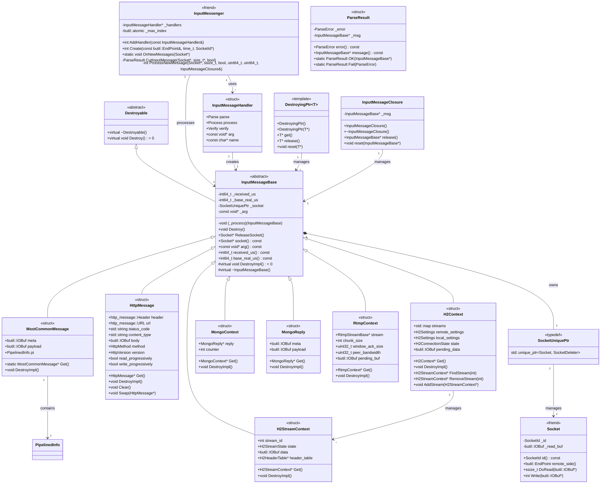
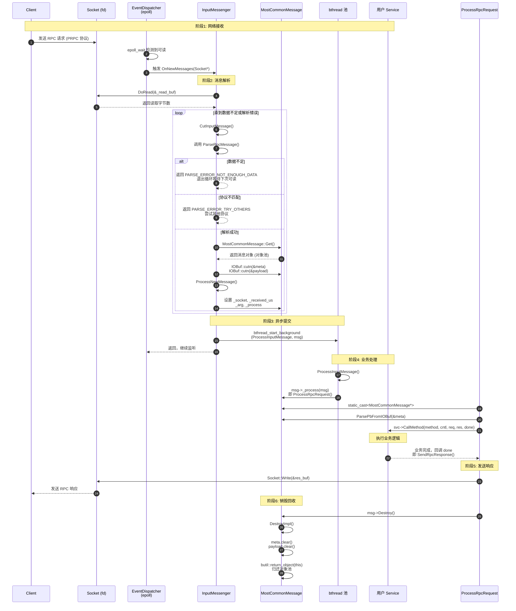
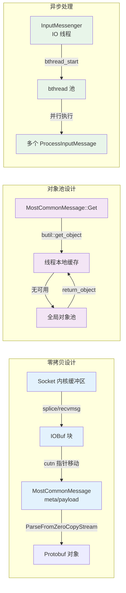

 我来详细解析 `InputMessenger` 类，这是 brpc 网络传输层的核心组件，负责处理所有网络读事件和消息解析。

## InputMessenger 核心定位

```
┌─────────────────────────────────────────────────────────┐
│                    InputMessenger                        │
│  "网络数据的入口处理器，连接 Socket 和 Protocol 的桥梁"    │
├─────────────────────────────────────────────────────────┤
│  职责：                                                  │
│  1. 处理 Socket 读事件 (epoll/kqueue 触发)               │
│  2. 从内核读取数据到 IOBuf                               │
│  3. 调用协议解析器切分消息边界                            │
│  4. 将完整消息分发给上层处理                              │
│  5. 管理解析状态和错误处理                                │
└─────────────────────────────────────────────────────────┘
```
我来绘制 `InputMessage` 的完整处理流程图，包括静态结构和动态调用。

## 一、相关类图
 我来基于最新 brpc 代码绘制 `InputMessage` 相关的完整类图。

### 完整类图（Mermaid 格式）



### 关键关系说明

| 关系类型 | 说明 |
|:---|:---|
| **继承** | `InputMessageBase` 继承 `Destroyable`，所有具体消息继承 `InputMessageBase` |
| **组合** | `InputMessageBase` 包含 `SocketUniquePtr`（消息来源） |
| **依赖** | `InputMessenger` 依赖 `InputMessageHandler` 回调创建和处理消息 |
| **关联** | `H2Context` 关联多个 `H2StreamContext`（流管理） |
| **模板** | `DestroyingPtr<T>` 模板类管理任意消息类型生命周期 |


## 二、动态处理流程图（核心）

### 主流程：从网络到业务

```mermaid
flowchart LR
    A[网络数据] --> B[epoll_wait]
    B --> C[OnNewMessages]
    
    subgraph 读取解析
        C --> D[DoRead]
        D --> E{解析成功?}
        E -->|否| F[等待/错误]
        E -->|是| G[MostCommonMessage::Get]
        G --> H[切分meta/payload]
    end
    
    subgraph 提交处理
        H --> I[填充_socket/time/arg/process]
        I --> J[bthread_start_background]
    end
    
    subgraph 业务执行
        J --> K[ProcessInputMessage]
        K --> L[msg->_process]
        L --> M[ProcessRpcRequest]
        M --> N[CallMethod]
        N --> O[SendRpcResponse]
    end
    
    subgraph 销毁回收
        O --> P[msg->Destroy]
        P --> Q[DestroyImpl]
        Q --> R[return_object]
    end
    
    F --> S[结束]
    R --> S
    
    style A fill:#e3f2fd
    style C fill:#bbdefb
    style G fill:#fff3e0
    style J fill:#c8e6c9
    style N fill:#a5d6a7
    style P fill:#ffebee
```


关键节点说明
| 节点        | 函数/类                       | 作用                   |
| :-------- | :------------------------- | :------------------- |
| **网络到达**  | `epoll_wait`               | 监听 Socket 可读事件       |
| **读取数据**  | `Socket::DoRead`           | 从内核读取到 `IOBuf`（零拷贝）  |
| **解析消息**  | `CutInputMessage`          | 调用协议 `parse` 回调切分消息  |
| **获取对象**  | `MostCommonMessage::Get`   | 从对象池分配消息（无锁）         |
| **填充元数据** | `ProcessNewMessage`        | 设置时间戳、Socket、处理函数    |
| **提交异步**  | `bthread_start_background` | 创建 bthread 执行，不阻塞 IO |
| **业务处理**  | `ProcessRpcRequest`        | 反序列化、查找方法、执行业务       |
| **销毁回收**  | `DestroyImpl`              | 清理 IOBuf，归还对象池       |


---

## 三、详细时序图（动态调用）

### 1. 服务端请求处理完整时序



---

## 四、关键函数调用链

### 1. 服务端完整调用链

```
InputMessenger::OnNewMessages(Socket* m)
    │
    ├── 1. 数据读取
    │   └── m->DoRead(&m->_read_buf)
    │       ├── recvmsg() / splice() [系统调用]
    │       └── 数据追加到 IOBuf (零拷贝)
    │
    ├── 2. 消息切分循环
    │   └── CutInputMessage(m, &index, read_eof)
    │       └── _handlers[i].parse(&m->_read_buf, m, read_eof, _handlers[i].arg)
    │           └── ParseRpcMessage(source, socket, read_eof, arg) [baidu_std协议]
    │               ├── 检查魔数 "PRPC"
    │               ├── 读取 body_size, meta_size
    │               ├── MostCommonMessage* msg = MostCommonMessage::Get()
    │               ├── source->cutn(&msg->meta, meta_size)
    │               ├── source->cutn(&msg->payload, body_size - meta_size)
    │               └── return MakeMessage(msg) → ParseResult
    │
    ├── 3. 消息处理
    │   └── ProcessNewMessage(m, bytes, read_eof, received_us, base_realtime, last_msg)
    │       ├── msg->_received_us = butil::cpuwide_time_us()
    │       ├── msg->_base_real_us = base_realtime
    │       ├── msg->_socket.reset(m) [引用计数+1]
    │       ├── msg->_arg = _handlers[index].arg
    │       ├── msg->_process = _handlers[index].process
    │       └── bthread_start_background(&tid, NULL, ProcessInputMessage, msg)
    │
    └── 4. 异步执行 (新 bthread)
        └── ProcessInputMessage(void* arg)
            └── msg->_process(msg) [即 ProcessRpcRequest]
                ├── DestroyingPtr<MostCommonMessage> msg_guard(msg)
                ├── ParsePbFromIOBuf(&rpc_meta, msg->meta)
                ├── server->FindMethodProperty() [查找服务方法]
                ├── messages = factory->Get() [获取请求/响应对象]
                ├── DeserializeRpcMessage(msg->payload, ...) [反序列化]
                ├── svc->CallMethod(method, cntl, req, res, done) [业务调用]
                └── SendRpcResponse(...) [发送响应]
                    └── msg->Destroy() [触发销毁]
                        └── MostCommonMessage::DestroyImpl()
                            ├── meta.clear()
                            ├── payload.clear()
                            └── butil::return_object(this) [归还对象池]
```

### 2. 客户端响应调用链

```
InputMessenger::OnNewMessages(Socket* m)
    │
    ├── ... [同上：读取、解析]
    │
    └── ProcessInputMessage(void* arg)
        └── msg->_process(msg) [即 ProcessRpcResponse]
            ├── DestroyingPtr<MostCommonMessage> msg_guard(msg)
            ├── ParsePbFromIOBuf(&rpc_meta, msg->meta)
            ├── bthread_id_lock(correlation_id, &cntl) [匹配请求]
            ├── DeserializeRpcMessage(msg->payload, ..., cntl->response())
            ├── accessor.OnResponse(correlation_id, saved_error)
            │   └── 唤醒等待的客户端调用
            └── msg->Destroy()
```

---

## 五、关键设计点标注



---

## 六、总结：核心流程口诀

```
一读：Socket::DoRead 从内核读数据
二切：CutInputMessage 协议解析切消息
三填：ProcessNewMessage 填充时间戳和回调
四提：bthread_start_background 提交异步处理
五调：msg->_process 调用业务逻辑
六发：SendRpcResponse 发送响应
七销：msg->Destroy 销毁归还对象池
```