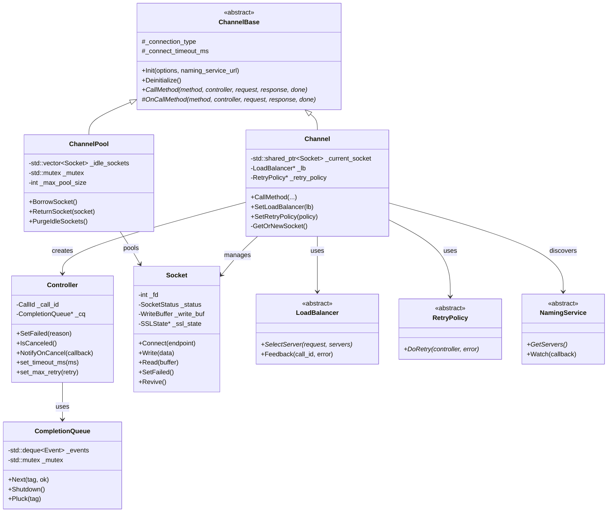

 我来为你详解 brpc 的 Channel 类及其相关核心类，并绘制类图和数据流图。

## brpc Channel 架构详解

### 核心类层次结构

```
┌─────────────────────────────────────────────────────────────┐
│                    brpc::ChannelBase                         │
│                    (抽象基类)                                  │
│  ┌─────────────────────────────────────────────────────┐    │
│  │  - Init() / Deinitialize()                          │    │
│  │  - CallMethod()  (纯虚函数)                          │    │
│  │  - 连接管理、健康检查基础接口                          │    │
│  └─────────────────────────────────────────────────────┘    │
└─────────────────────────────────────────────────────────────┘
                              ▲
                              │ 继承
        ┌─────────────────────┴─────────────────────┐
        │                                           │
┌───────┴────────┐                          ┌─────┴──────────┐
│   Channel      │                          │  ChannelPool   │
│  (同步/异步通道)  │                          │   (连接池管理)   │
│                │                          │                │
│ ┌────────────┐ │                          │ ┌────────────┐ │
│ │- 单连接管理  │ │                          │ │- 多连接管理  │ │
│ │- 负载均衡   │ │                          │ │- 连接复用   │ │
│ │- 重试策略   │ │                          │ │- 并发控制   │ │
│ └────────────┘ │                          │ └────────────┘ │
└────────────────┘                          └────────────────┘
        │
        ├──────────────────┬──────────────────┐
        │                  │                  │
   ┌────┴────┐       ┌────┴────┐       ┌────┴────┐
   │ 短连接   │       │ 长连接   │       │ 连接池   │
   │Channel  │       │Channel  │       │Channel  │
   └─────────┘       └─────────┘       └─────────┘
```

### 详细类图 (Mermaid 语法)



---

### 关键设计模式

| 模式 | 应用位置 | 说明 |
|------|---------|------|
| **对象池** | SocketPool | 复用TCP连接，减少握手开销 |
| **状态机** | Socket::Status | 管理连接生命周期状态 |
| **策略模式** | LoadBalancer/RetryPolicy | 可插拔的LB和重试算法 |
| **观察者** | NamingService::Watch | 服务列表变更通知 |
| **零拷贝** | WriteBuffer | 减少数据复制开销 |
| **引用计数** | Socket | 线程安全的连接生命周期管理 |


## 对于channel的理解

| 层级 | 职责 | 标识什么 |
|:---|:---|:---|
| **Service/Method** | 业务逻辑接口 | **标识方法**（通信录） |
| **Channel** | 网络传输管道 | **标识对端**（通路） |
| **Controller** | 单次请求的上下文 | **标识单次请求** (单辆车)|

```
传统函数调用                    RPC 调用
─────────────                  ─────────
函数指针 fp = &foo;            Channel ch("127.0.0.1:8000");
                             
fp(arg);  // 直接跳转          stub.Method(req);  
                              // 1. stub 知道调什么方法（Method） (通信录)
                              // 2. channel 知道送到哪（127.0.0.1:8000）。(通路)
                              // 3. 两者结合完成远程调用
```

---

## brpc Channel 的核心配置

```cpp
brpc::ChannelOptions options;
options.protocol = "baidu_std";     // 怎么送（协议）
options.connection_type = "pooled"; // 连接方式（单/池/短连接）
options.timeout_ms = 1000;          // 多久算超时
options.max_retry = 3;              // 失败重试几次

brpc::Channel channel;
channel.Init("consul://user-service",  // 送到哪（服务发现地址）
             "rr",                      // 怎么选（负载均衡）
             &options);
```

---

## 为什么需要 Channel 抽象？

```
┌─────────────────────────────────────────┐
│           多个 Stub 共享 Channel          │
│                                         │
│  UserService_Stub ──┐                   │
│  OrderService_Stub ─┼──► Channel ──► 服务器集群
│  PayService_Stub ───┘   (连接池复用)      │
│                                         │
│  优势：                                  │
│  1. 共享 TCP 连接（减少连接数）            │
│  2. 统一配置（超时、重试、协议）            │
│  3. 统一服务发现和负载均衡                 │
└─────────────────────────────────────────────────────────┘
```

---

## 总结

| 问题 | 答案 |
|:---|:---|
| Channel 标识方法吗？ | **不**，标识的是**对端服务地址和传输方式**(通路) |
| 谁标识方法？ | **Stub/Service** 通过 `method_descriptor` 标识(通讯录) |
| 为什么分离？ | 解耦**接口定义**（Service）和**传输实现**（Channel） |


---

## 类比
 你的理解**非常准确**，这是一个很形象的比喻。让我帮你进一步完善这个模型，并澄清一些细节：

---

## 你的理解 ✅

```
┌─────────────────────────────────────────┐
│           Channel（路/高速公路）          │
│  ┌─────────────────────────────────┐    │
│  │  基础设施：                       │    │
│  │  - 起点终点（服务地址/命名服务）    │    │
│  │  - 车道规则（协议：baidu_std/http） │    │
│  │  - 限速（超时配置）                │    │
│  │  - 导航系统（负载均衡）             │    │
│  │  - 收费站（连接池管理）             │    │
│  └─────────────────────────────────┘    │
│                                         │
│  长期存在，可复用，线程安全               │
└─────────────────────────────────────────┘
            │
            │  多辆车并发通行（多线程请求）
            ▼
┌─────────────────────────────────────────┐
│  Controller 1（车 A）  Controller 2（车 B）│
│  单次请求的上下文        单次请求的上下文   │
│                                         │
│  ┌─────────────┐        ┌─────────────┐ │
│  │ 车牌号      │        │ 车牌号       │ │
│  │ CallId      │        │ CallId      │ │
│  ├─────────────┤        ├─────────────┤ │
│  │ 乘客信息     │        │ 乘客信息     │ │
│  │ Request     │        │ Request     │ │
│  ├─────────────┤        ├─────────────┤ │
│  │ 目的地回复   │        │ 目的地回复   │ │
│  │ Response    │        │ Response    │ │
│  ├─────────────┤        ├─────────────┤ │
│  │ 行驶状态     │        │ 行驶状态     │ │
│  │ - 已发送？   │        │ - 已发送？   │ │
│  │ - 已响应？   │        │ - 已响应？   │ │
│  │ - 错误码     │        │ - 超时时间   │ │
│  └─────────────┘        └─────────────┘ │
│                                         │
│  每次请求新建，请求结束销毁（或复用）      │
└─────────────────────────────────────────┘
```

---

## 细节完善

### 1. Controller 的生命周期

| 场景 | 生命周期 | 类比 |
|:---|:---|:---|
| **同步调用** | 栈上临时对象，函数返回即销毁 | 临时包车，用完即弃 |
| **异步调用** | `new Controller`，在回调中 `delete` | 预约专车，到站后报废 |
| **连接复用** | brpc 内部优化，可能池化复用 | 出租车公司，车壳复用 |

```cpp
// 同步：栈上临时车
void sync_call() {
    brpc::Controller cntl;  // 临时车
    stub.Method(&cntl, ...); // 跑一趟
} // 车销毁

// 异步：堆上持久车
void async_call() {
    brpc::Controller* cntl = new brpc::Controller;  // 预约车
    google::protobuf::Closure* done = 
        brpc::NewCallback(handle_response, cntl);
    stub.Method(cntl, ..., done);  // 发车
} // 车继续跑，响应后回调里 delete
```

### 2. Channel 的"路"是复用的

```
Channel 初始化（修路）：
┌─────────────────────────────────────────┐
│  channel.Init("consul://user-service")  │
│                                         │
│  建立：                                 │
│  - 服务发现连接（NamingService）          │
│  - 连接池配置（但不立即建连接）            │
│  - 负载均衡器（SharedLoadBalancer）       │
└─────────────────────────────────────────┘
            │
            ▼
多次请求复用同一条路：
┌─────────┐    ┌─────────┐    ┌─────────┐
│ Req 1   │    │ Req 2   │    │ Req 3   │
│ Ctrl A  │    │ Ctrl B  │    │ Ctrl C  │
└────┬────┘    └────┬────┘    └────┬────┘
     │              │              │
     └──────────────┼──────────────┘
                    ▼
            ┌─────────────┐
            │  Channel    │
            │  共享的路    │
            │  - 连接池    │
            │  - 负载均衡  │
            └─────────────┘
```

### 3. 多辆车并发：线程安全

```
线程 1 ──► Controller A ──┐
                           ├──► Channel（线程安全）
线程 2 ──► Controller B ──┤      │
                           │      ▼
线程 3 ──► Controller C ──┘   Socket 连接池
                                    │
                              ┌─────┴─────┐
                              ▼           ▼
                           Conn 1      Conn 2  ──► 服务器
```

**关键：**
- `Channel`：线程安全，多线程并发调用 `CallMethod`
- `Controller`：每个请求独立，**不共享**（除非常特殊场景）
- `Socket`：内部连接池管理，多 `Controller` 复用连接

---

## 对比官方概念

| brpc 概念 | 你的比喻 | 实际职责 |
|:---|:---|:---|
| **Channel** | 高速公路 | 服务发现、负载均衡、连接池、协议配置 |
| **Controller** | 一辆车 | 单次请求的上下文、超时、重试、错误处理、回调 |
| **Stub** | 司机/导航仪 | 类型安全的方法调用，将业务方法转为 RPC 调用 |
| **CallId** | 车牌号 | 唯一标识一次 RPC，用于追踪、超时、取消 |
| **Socket** | 车道/物理路面 | 实际的 TCP 连接，管理发送缓冲区和接收数据 |

---

## 一个完整的"出行"流程

```
用户想调用 GetUserInfo(user_id=42)

    │
    ▼
┌─────────────────────────────────────────┐
│  1. 准备出行（创建 Controller）           │
│                                         │
│  Controller cntl;                       │
│  cntl.set_timeout_ms(1000);  // 1小时到达 │
│  cntl.set_log_id(12345);     // 行程单号  │
└─────────────────────────────────────────┘
    │
    ▼
┌─────────────────────────────────────────┐
│  2. 叫司机（创建 Stub）                  │
│                                         │
│  UserService_Stub stub(&channel);        │
│  // 司机知道路线（protobuf 方法定义）      │
└─────────────────────────────────────────┘
    │
    ▼
┌─────────────────────────────────────────┐
│  3. 出发（调用方法）                      │
│                                         │
│  stub.GetUserInfo(&cntl, &request,       │
│                   &response, done);      │
│                                         │
│  内部流程：                              │
│  - Stub：打包乘客信息（序列化 request）    │
│  - Channel：查导航选路（负载均衡选服务器）  │
│  - Channel：找空闲车道（获取 Socket）      │
│  - Socket：发车（发送数据）                │
│  - Controller：记录发车时间、状态          │
└─────────────────────────────────────────┘
    │
    ▼
┌─────────────────────────────────────────┐
│  4. 到达目的地（收到响应）                 │
│                                         │
│  - Controller 标记：已到达、耗时、错误码   │
│  - 如果是异步：回调通知（车到了打电话）     │
│  - 乘客下车（解析 response）              │
└─────────────────────────────────────────┘
    │
    ▼
┌─────────────────────────────────────────┐
│  5. 报废车辆（销毁 Controller）            │
│                                         │
│  同步：函数返回自动销毁                    │
│  异步：回调中 delete                      │
└─────────────────────────────────────────┘
```

---

## 常见误区澄清

| 误区 | 正确理解 |
|:---|:---|
| "Channel 是一次性的" | ❌ Channel 长期复用，类似数据库连接池 |
| "Controller 可以复用" | ⚠️ 同步调用后状态已乱，不可复用；异步需新建 |
| "多请求共享 Controller" | ❌ 绝对错误，会导致状态混乱、回调冲突 |
| "Stub 有状态" | ❌ Stub 无状态，只是 Channel 的包装，可临时创建 |

---

## 一句话总结

> **你的比喻完全正确：Channel 是修好的高速公路（基础设施，复用），Controller 是每次出行的车辆（请求上下文，隔离），Stub 是司机（方法路由，无状态）。多辆车（多线程）并发跑在同一条路上，互不影响。**