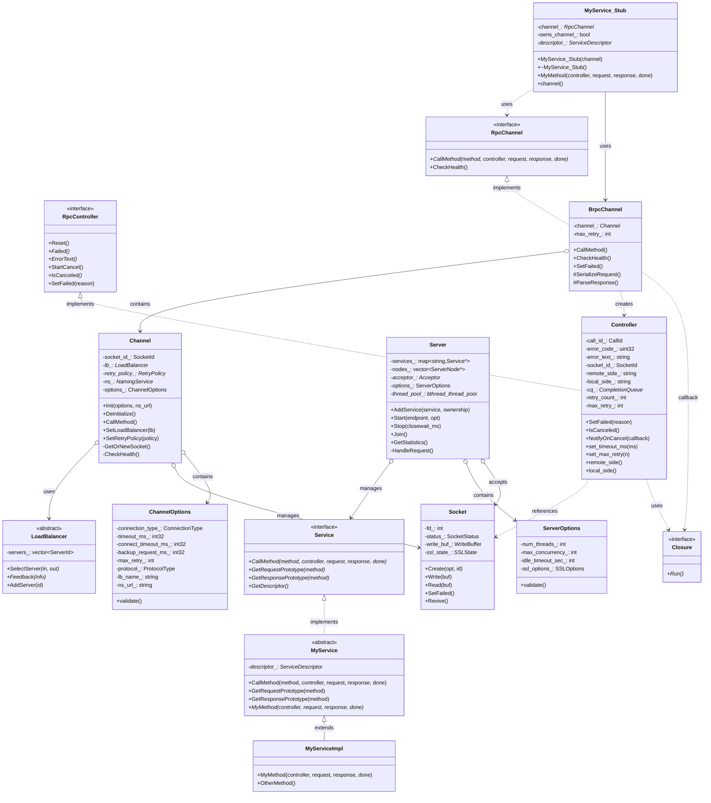

```mermaid
classDiagram
    %% ==================== protobuf 接口层 ====================
    class Service {
        <<interface>>
        +CallMethod(method, controller, request, response, done)*
        +GetRequestPrototype(method)*
        +GetResponsePrototype(method)*
        +GetDescriptor()*
    }
    
    class RpcChannel {
        <<interface>>
        +CallMethod(method, controller, request, response, done)*
        +CheckHealth()
    }
    
    class RpcController {
        <<interface>>
        +Reset()
        +Failed()*
        +ErrorText()*
        +StartCancel()
        +IsCanceled()*
        +SetFailed(reason)
    }
    
    class Closure {
        <<interface>>
        +Run()*
    }
    
    %% ==================== brpc 核心实现层 ====================
    class BrpcChannel {
        -channel_: Channel*
        -max_retry_: int
        +CallMethod()
        +CheckHealth()
        +SetFailed()
        #SerializeRequest()
        #ParseResponse()
    }
    
    class Channel {
        -socket_id_: SocketId
        -lb_: LoadBalancer*
        -retry_policy_: RetryPolicy*
        -ns_: NamingService*
        -options_: ChannelOptions
        +Init(options, ns_url)
        +Deinitialize()
        +CallMethod()
        +SetLoadBalancer(lb)
        +SetRetryPolicy(policy)
        -GetOrNewSocket()
        -CheckHealth()
    }
    
    class Server {
        -services_: map~string,Service*~
        -nodes_: vector~ServerNode*~
        -acceptor_: Acceptor*
        -options_: ServerOptions
        -thread_pool_: bthread_thread_pool*
        +AddService(service, ownership)
        +Start(endpoint, opt)
        +Stop(closewait_ms)
        +Join()
        +GetStatistics()
        -HandleRequest()
    }
    
    class Controller {
        -call_id_: CallId
        -error_code_: uint32
        -error_text_: string
        -socket_id_: SocketId
        -remote_side_: string
        -local_side_: string
        -cq_: CompletionQueue*
        -retry_count_: int
        -max_retry_: int
        +SetFailed(reason)
        +IsCanceled()
        +NotifyOnCancel(callback)
        +set_timeout_ms(ms)
        +set_max_retry(n)
        +remote_side()
        +local_side()
    }
    
    class Socket {
        -fd_: int
        -status_: SocketStatus
        -write_buf_: WriteBuffer
        -ssl_state_: SSLState*
        +Create(opt, id)
        +Write(buf)
        +Read(buf)
        +SetFailed()
        +Revive()
    }
    
    class LoadBalancer {
        <<abstract>>
        -servers_: vector~ServerId~
        +SelectServer(in, out)*
        +Feedback(info)*
        +AddServer(id)
    }
    
    %% ==================== 生成代码层 ====================
    class MyService {
        <<abstract>>
        -descriptor_: ServiceDescriptor*
        +CallMethod(method, controller, request, response, done)
        +GetRequestPrototype(method)
        +GetResponsePrototype(method)
        +MyMethod(controller, request, response, done)*
    }
    
    class MyService_Stub {
        -channel_: RpcChannel*
        -owns_channel_: bool
        -descriptor_: ServiceDescriptor*
        +MyService_Stub(channel)
        +~MyService_Stub()
        +MyMethod(controller, request, response, done)
        +channel()
    }
    
    %% ==================== 用户实现层 ====================
    class MyServiceImpl {
        +MyMethod(controller, request, response, done)
        +OtherMethod()
    }
    
    %% ==================== 配置类 ====================
    class ChannelOptions {
        -connection_type_: ConnectionType
        -timeout_ms_: int32
        -connect_timeout_ms_: int32
        -backup_request_ms_: int32
        -max_retry_: int
        -protocol_: ProtocolType
        -lb_name_: string
        -ns_url_: string
        +validate()
    }
    
    class ServerOptions {
        -num_threads_: int
        -max_concurrency_: int
        -idle_timeout_sec_: int
        -ssl_options_: SSLOptions
        +validate()
    }
    
    %% ==================== 关系定义 ====================
    Service <|.. MyService : implements
    RpcChannel <|.. BrpcChannel : implements
    RpcController <|.. Controller : implements
    
    MyService <|-- MyServiceImpl : extends
    MyService_Stub ..> RpcChannel : uses
    
    BrpcChannel o--> Channel : contains
    MyService_Stub --> BrpcChannel : uses
    
    Server o--> Service : manages
    Server o--> ServerOptions : contains
    Server o--> Socket : accepts
    
    Channel o--> LoadBalancer : uses
    Channel o--> Socket : manages
    Channel o--> ChannelOptions : contains
    
    Controller ..> Socket : references
    Controller ..> Closure : uses
    
    BrpcChannel ..> Controller : creates
    BrpcChannel ..> Closure : callback
```