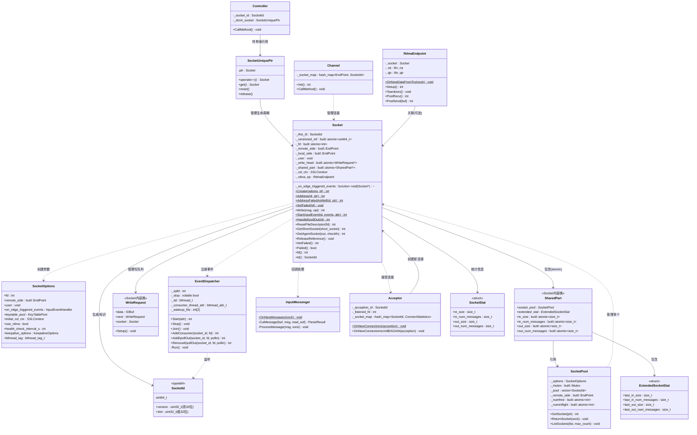

 我来为您解析brpc中Socket类的设计，并绘制相关类图。让我先搜索brpc的源代码信息。 
 让我进一步搜索更多关于Socket相关的类信息，以便绘制完整的类图。 
  现在我已经收集了足够的信息，让我为您详细解析brpc中Socket类的设计，并绘制相关的类图。

## brpc Socket类设计解析

### 1. 核心设计理念

brpc的Socket类是整个RPC框架中最复杂的结构之一，其独特之处在于使用**64位SocketId**来指代Socket对象，以便在多线程环境下安全地使用fd资源。这种设计类似于`shared_ptr`/`weak_ptr`机制，但增加了关键的`SetFailed`功能。

### 2. Socket类涉及的核心类

根据搜索结果，以下是Socket类设计中的关键协作类：

#### **SocketId** (uint64_t)
- 64位整数，高32位是版本号，低32位是资源池槽位
- 类似`weak_ptr`的弱引用机制
- 可安全存储在epoll数据中，避免ABA问题

#### **SocketUniquePtr** 
- 包装Socket指针的智能指针，类似`shared_ptr`
- 通过`Socket::Address(SocketId, SocketUniquePtr*)`获取
- 自动管理引用计数，离开作用域时自动释放

#### **SocketOptions**
- Socket创建时的配置选项结构体
- 包含：fd、remote_side、user、on_edge_triggered_events、ssl_ctx、keytable_pool等

#### **SocketPool** 
- 连接池管理类
- 管理到同一端点的多个连接
- 提供`GetSocket()`和`ReturnSocket()`方法

#### **SharedPart** (Socket内部)
- Socket的共享状态部分
- 包含统计信息、连接池指针、扩展状态等
- 多个Socket可共享（如连接池中的Socket共享统计）

#### **EventDispatcher**
- 事件分发器
- 监听fd上的EPOLLIN/EPOLLOUT事件
- 使用边缘触发(Edge Triggered)模式
- 通过`Socket::StartInputEvent`和`Socket::HandleEpollOut`处理事件

#### **InputMessenger**
- 消息输入处理器
- 从连接上切割消息并分发
- 支持协议探测和多消息并发处理

#### **Acceptor**
- 服务器端接收器
- 监听端口并接受新连接
- 创建新Socket并设置`InputMessenger::OnNewMessages`为事件回调

#### **WriteRequest**
- Socket内部的写请求结构
- 组成无锁写队列（链表结构）
- 支持批量写入和合并

#### **RdmaEndpoint** (可选)
- RDMA端点实现
- 当启用RDMA时替代TCP传输
- 处理RDMA特定的事件和数据传输

#### **SocketMessage**
- Socket消息接口
- 定义消息的序列化和处理接口

---

### 3. 类图（Mermaid格式）

---

### 4. 关键交互流程

#### **Socket创建流程**：
1. 调用`Socket::Create(SocketOptions, SocketId*)` 
2. 从资源池获取Socket对象槽位
3. 初始化Socket成员，设置版本号+槽位组成SocketId
4. 如果提供了fd，调用`ResetFileDescriptor`设置非阻塞、TCP_NODELAY等
5. 如果设置了`on_edge_triggered_events`，调用`EventDispatcher::AddConsumer`注册到epoll

#### **Socket使用流程**：
1. 通过`Socket::Address(SocketId, SocketUniquePtr*)`获取智能指针（wait-free）
2. 如果返回成功，Socket保证有效且内容不变
3. 使用Socket进行读写操作
4. SocketUniquePtr析构时自动减少引用计数

#### **Socket销毁流程**：
1. 调用`Socket::SetFailed()`标记失败（lock-free）
2. 后续`Address`返回空指针
3. 当引用计数归零，触发`OnRecycle`回调
4. 如果有关联的SocketPool，归还给连接池或销毁

#### **写操作流程**：
1. 构造WriteRequest，设置数据和回调
2. 使用CAS操作将请求加入`_write_head`链表
3. 如果当前无写入在进行，启动`KeepWrite` bthread
4. `KeepWrite`批量处理写队列中的请求

---

### 5. 设计亮点总结

| 特性 | 说明 |
|------|------|
| **SocketId机制** | 64位ID替代裸指针，避免ABA问题，支持wait-free的Address操作 |
| **引用计数管理** | SocketUniquePtr自动管理，SetFailed强制失效确保资源回收 |
| **无锁写队列** | WriteRequest链表+CAS操作，实现高并发写入 |
| **边缘触发** | EventDispatcher使用EPOLLET，减少epoll_ctl开销 |
| **连接池集成** | SharedPart设计支持Socket间共享统计和连接池 |
| **协议无关** | 通过on_edge_triggered_events回调支持多种协议 |

这种设计使得brpc能够在高并发场景下高效管理大量连接，同时保证资源安全和快速回收。