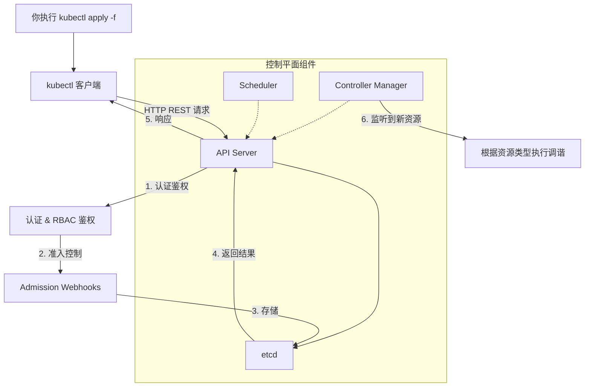

`kubectl apply -f` 这条命令虽然看起来简单，但它的执行链路会贯穿整个 Kubernetes 集群的控制平面，其依赖的组件如下图所示：

时序图：
![[deepseek_mermaid_20260724_0db390.png]]

这条链路按顺序依赖以下几个核心组件：

### 1. 本地依赖：kubectl 本身
- **依赖内容**：`kubectl` 是可执行文件，需要已安装且版本与集群接近。
- **依赖文件**：默认读取 `~/.kube/config` 配置文件，其中包含了 API Server 的地址、认证信息（证书或 Token）和上下文。

### 2. 核心依赖：API Server（控制平面入口）
- **角色**：这是 `kubectl` 直接通信的唯一组件。
- **工作内容**：kubectl 将 YAML/JSON 文件内容通过 **HTTP REST 请求**（通常是 `POST` 或 `PUT`）发送给 API Server 的 `/apis/...` 或 `/api/v1/...` 路径。

### 3. 功能依赖（由 API Server 内部完成）

#### ① 认证（Authentication）模块
- **依赖**：API Server 配置的认证方式（如 X509 客户端证书、Bearer Token、OIDC）。
- **作用**：确认“你是谁”。如果你的 kubeconfig 证书过期或权限不足，会在此步被拦截（返回 `401 Unauthorized`）。

#### ② 鉴权（Authorization）模块
- **依赖**：RBAC（基于角色的访问控制）系统。
- **作用**：确认“你能否对 `nginx` 这个资源执行 `create` 操作”。
- **关键检查**：ServiceAccount 或用户的角色绑定必须允许该操作，否则返回 `403 Forbidden`。

#### ③ 准入控制（Admission Control）
- **依赖**：集群中配置的 **MutatingAdmissionWebhook** 和 **ValidatingAdmissionWebhook**（比如 Istio、Pod Security Policy 或 OPA 策略引擎）。
- **作用**：
    - 可以在资源持久化之前**修改**（Mutation）它，例如 Istio 自动注入 Sidecar 容器。
    - 可以**验证**（Validation）它是否符合集群策略。
- **影响**：即使 YAML 语法正确，如果 Webhook 拦截并拒绝（如违反安全策略），创建也会失败。

### 4. 存储依赖：etcd
- **角色**：API Server 将经过上述检查后的资源清单（Manifest）以 JSON 格式持久化存储到 etcd 中。
- **注意**：此时 etcd **只存储了你定义的期望状态（Desired State）**，比如“我要运行一个 Nginx 容器”，但还没有真正创建 Pod。

### 5. 后续异步依赖（非 `kubectl apply` 阻塞依赖）

一旦 API Server 返回 `201 Created` 或 `200 OK`，`kubectl` 命令就结束了。但集群内的其他组件会开始工作，它们是**保证最终一致性**的依赖：

- **Controller Manager（控制管理器）**：内部的 **Deployment Controller** 会监听到新的 Deployment 资源。它将创建 ReplicaSet，再由 **ReplicaSet Controller** 创建 Pod 对象。
- **Scheduler（调度器）**：监听到未调度的 Pod（`nodeName` 为空），会为其选择合适的节点（Node）。
- **kubelet（节点组件）**：在目标节点上监听到被调度给它的 Pod，调用 CRI 接口（如 containerd）去真正启动容器。

---

### 一张表总结依赖层次

| 阶段 | 依赖组件 | 作用 | 失败后果 |
| :--- | :--- | :--- | :--- |
| **1. 客户端解析** | `kubectl` + `kubeconfig` | 解析 YAML，构造 REST 请求 | 提示 `error: unable to read ...` |
| **2. 安全过滤** | API Server 的认证 & RBAC 鉴权模块 | 检查身份和操作权限 | 提示 `401` 或 `403` 错误 |
| **3. 策略拦截** | Admission Webhook（如 Istio, OPA） | 修改或验证资源合法性 | 提示 `failed by webhook` |
| **4. 持久存储** | API Server + etcd | 将资源对象以 JSON 存入 etcd | 提示 `500 Internal Server Error` |
| **5. 异步调谐** | Controller Manager + Scheduler + kubelet | 根据资源类型处理逻辑，将状态变为最终期望状态 | 资源创建成功但状态异常（如 Pod 一直 Pending） |

所以，当 `kubectl apply -f` 执行时，YAML 文件经过 API Server 完成认证、鉴权、准入校验，最终存储在 etcd 中。至于真正拉起 Pod，则是 API Server、Controller Manager、Scheduler 和 kubelet 等组件接力完成的结果，这也是 Kubernetes 声明式 API 得以实现的基石。